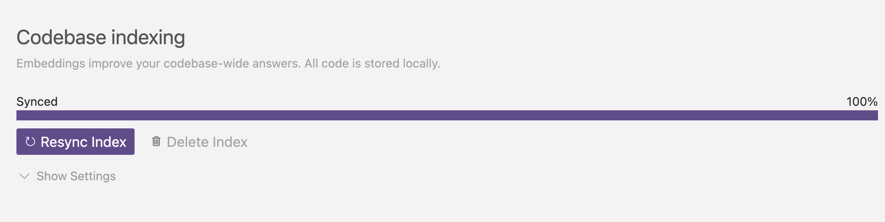
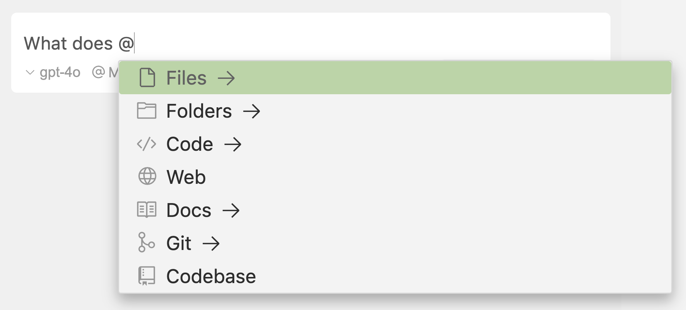

# Cursor快速上手+科学使用指南

## 一、前言

简单工作不想做

复杂工作不会做

出现错误不会解决

后端程序员不会写前端

前端程序员不会写后端

可爱的大学生要写期末作业

## 二、Cursor概述、安装以及环境配置

### 2.1 概述

Cursor 是一款功能强大的 AI 优先代码编辑器，可增强我们的开发工作流程。主要提供三个核心方向，这些功能可以无缝地协同工作，从而提高工作效率：

- 深度集成AI模型，不是简单地接入模型，而是让AI充当了编译器的核心交互方式。支持代码块对话、项目级对话、模型自由选择。
- 强上下文理解能力，可以自动识别项目文件、代码块、错误信息等等，提供更直观准确的AI修改能力。
- 对话式开发体验，仅需用自然语言沟通，Cursor就会根据指令完成布置的任务，使用者可以轻松扮演产品经理，让Cursor理解你的命令自行工作。


**对比其他编辑工具来说：**

- 对比VS Code :  基于Visual Studio Code打造而成的AI编程工具，因此界面和基础操作与 VS Code 高度相似，无缝衔接！
- 对比 JetBrains IDEA：Cursor 提供 AI 驱动的现代编码体验，可以取代 JetBrains IDE，JetBrains 程序员可能会感觉不同！

### 2.2 安装、登录和无限续杯

>  快速安装 Cursor、登录指南！！！！

#### 2.2.1 安装

* 访问 [cursor.com](https://cursor.com/) 并单击 “下载” 按钮（安装包在资料文件夹 版本0.50.7）
* 运行安装程序并等待安装完成
* 通过桌面快捷方式或从应用菜单启动 Cursor即可

#### 2.2.2 登录

* 点击 **“注册”** 或 **“登录”** 后，系统会提示您设置一个帐户。可以选择使用邮件，或者注册 Google 或 GitHub。

  > 如果第一次使用 Cursor，将获得 14 天的免费试用期 。

* 登录后，送回 Cursor，然后就可以**开始编码了！**

#### 2.2.3 无限续杯

​	Cursor新注册后有着14天免费，50次免费高级提问的额度，但是也很轻易就会到上限的。其通过检测用户的邮箱账号以及电脑的机器码进行识别。我们出于学习的意图，可以尝试在达到上限后绕过这些限制继续学习，更推荐进行付费使用，功能也会更强大！

1. 准备新邮箱

​	  可以去2925无限邮注册一个账号，这个邮箱平台的一个优势是用户申请的邮箱之后，可以自行创建子邮箱。比方说，我创建了atguigu@2925.com这个邮箱，那么我们在申请账号的时候，可以使用atguigu123@2925.com、atguiguabc@2925.com、atguigu666@2925.COM等邮箱进行注册（也就是atguigu数字随意添加@2925.com），邮箱问题得以解决！注册地址： https://www.2925.com/

2. 机器码识别破解

​	其次是机器码识别方面。Cursor的团队意识到了人们会通过换邮箱的方式投机取巧，于是加入了校验本机机器码的环节。即使用户注册了一个新的邮箱，但是机器码所属的额度用完之后，也是不能继续免费了。于是此开源项目便诞生了【yeongpin/cursor-free-vip】，可以帮我们进行重置机器码，并且快速注册新的账号等功能！	

* https://github.com/yeongpin/cursor-free-vip/releases下载cusor-free-vip软件！（资料含下载完的软件）

* 右键管理员身份运行

* 重置机器ID （选择1）

  

* 重新注册和登录即可（选择2，会跳出注册流程）

  

### 2.3 Cursor配置说明以及汉化

在 Cursor 中，**Cursor Settings** 和 **Editor Settings** 是两个不同的配置入口，分别用于管理 **AI 功能** 和 **编辑器基础设置**。

| **对比项**       | **Cursor Settings**                    | **Editor Settings**                |
| ---------------- | -------------------------------------- | ---------------------------------- |
| **功能定位**     | 管理 AI 相关功能和 Cursor 特有设置     | 调整编辑器基础行为和外观           |
| **继承性**       | 与 VS Code 差异较大（Cursor 独有功能） | 大部分继承自 VS Code（如主题设置） |
| **影响范围**     | 影响 AI 代码生成、分析、对话的效果     | 影响代码编辑体验（如排版、颜色）   |
| **典型配置示例** | 调整 AI 模型参数、代码库索引路径       | 修改字体、启用自动保存、更改主题   |

#### 2.3.1 Cursor AI相关设置

`通过齿轮图标、Cmd/Ctrl + Shift + J`  开启`光标设置，即可进行AI编程相关的定制配置：

**以下是对 Cursor Settings 中各项配置的作用解释：**

- **General（常规）**：包含账户相关设置，可进行登录、注册操作，实现配置在不同设备间的同步 ；能进行 VS Code 配置导入，快速迁移主题、快捷键等设置；还隐私配置管理。
- **Features（功能）**：可开关 AI 代码补全、对话模式（Ask、Edit、Agent ）等核心功能；还能对这些功能的相关参数进行微调，比如调整代码补全的触发灵敏度、对话模式的快捷操作设置等 。
- **Models（模型）：**允许用户选择不同的 AI 模型（有多个可用选项 ）；添加模型和配置模型访问API Key等。
- **Rules（规则）：**例如可以制定代码检查规则，像对代码格式、语法规范等进行约束；也能设置特定代码操作的规则，比如当进行代码重构、修改时遵循的逻辑和标准等 。
- **MCP:** 配置多MCP操作的相关行为，比如选择代码时的联动规则、批量编辑代码的方式等，帮助开发者更高效地对多处代码进行统一操作 。
- **Indexing（索引):**  定义需要被索引的代码库路径，让 Cursor 的 AI 能理解代码上下文；设置排除规则，排除不需要索引的文件或文件夹（如第三方库、缓存文件 ），提高索引效率和 AI 分析的准确性。
- **Beta（测试版）:**  可启用或禁用测试功能，提供反馈等。用户能通过这里尝试 Cursor 的新功能，并帮助开发团队测试和改进这些尚未正式发布的特性 。

#### 2.432 Cursor 编辑器设置

通过命令面板访问 （`Cmd/Ctrl + Shift + P`） > `"Preferences: Open Settings (UI)"`

调整编辑器行为和外观，此处和VS Code一致：


**在 Cursor 编辑器设置中，“User” 和 “Workspace” 存在以下差异：**

User（用户）

- 作用范围：User 设置是全局性的，应用于当前登录用户在所有工作空间中的操作。无论打开哪个项目或工作空间，这些设置都始终生效。
- 数据存储：User 设置存储在用户的配置文件中，与特定项目无关。当在不同设备上登录同一账号时，User 设置会同步，保证一致的使用体验。

Workspace（工作空间）

- 作用范围：Workspace 设置仅在特定的工作空间（一般对应一个项目文件夹 ）内有效。不同的工作空间可以有各自独立的设置，互不影响。
- 数据存储：Workspace 设置存储在工作空间根目录下的 `.vscode` 文件夹（Cursor 基于 VS Code，沿用类似结构 ）中，仅在该工作空间打开时生效。

#### 2.3.3 Cursor 汉化配置

Cursor工具汉化配置步骤：

1. **打开扩展**：启动 Cursor 后，按下`Ctrl + Shift + X`（Windows/Linux）或`Cmd + Shift + X`（Mac） ，左侧边栏会出现扩展商店界面。
2. **搜索并安装插件**：在搜索框输入 "Chinese" 或 "中文" ，一般选择下载量最高的 "Chinese (Simplified) Language Pack for Visual Studio Code"，点击安装按钮进行安装。
3. **打开命令面板**：按下`Ctrl + Shift + P`（Windows/Linux）或`Cmd + Shift + P`（Mac） ，输入 "Configure Display Language" 并回车，进入语言配置界面。
4. **选择中文并重启**：在弹出的语言列表中选择 "中文（简体）" 或 "zh-cn" ，保存设置后重启 Cursor。此时界面将完全切换为中文，包括菜单、提示信息和设置选项 。

### 2.4 从VS Code配置迁移

#### 2.4.1 一键导入配置

一键导入功能，导入的是当前电脑中默认位置存储的vs code的配置文件！这将转移vs code的：Extensions  扩展、Themes  主题、Settings  设置、Keybindings  键绑定等！

> **VS Code 的配置文件默认位置为：**
>
> * **window系统**: 导入的是 “%appdata%\code\user\” 路径下的配置文件。该路径下的 “settings.json” 文件
>
> * **macOS系统**: 导入的是 “~/Library/Application Support/Code/User/” 路径下的配置内容。
>
> * **Linux系统**: 导入的是 “~/.config/code/user/” 路径下的配置文件，涵盖了个性化设置、快捷键设置等。
>
> **注意：**并非所有 VS Code 扩展都与 Cursor 兼容。一些依赖 VS Code 特定 API 的插件，在导入时可能导致整个导入过程失败或部分功能（如主题显示）异常。

1. 打开Cursor设置 （ ⌘ / Ctrl + Shift + J ）

2. 导航到 常规 > 帐户

3. 在“VS Code Import（VS Code 导入）”下，单击“导入”按钮

   

#### 2.4.2 手动配置文件迁移

如果要在计算机之间移动，或者希望对设置进行更多控制，则可以手动迁移配置文件。

**导出配置文件**

1. 在 VS Code 实例上，打开命令面板 （ ⌘ / Ctrl + Shift + P ）
2. 搜索 “Preferences： Open Profiles （UI）”
3. 在左侧边栏上找到要导出的个人资料
4. 单击 3 个点菜单并选择 “Export Profile”
5. 选择将其导出到本地计算机或 GitHub Gist

**导入配置文件**

1. 在 Cursor 实例上，打开 Command Palette （ ⌘ / Ctrl + Shift + P ）
2. 搜索 “Preferences： Open Profiles （UI）”
3. 单击“New Profile”旁边的下拉菜单，然后单击“Import Profile”
4. 粘贴 GitHub Gist 的 URL 或选择“选择文件”以上传本地文件
5. 单击对话框底部的 'Import' 以保存配置文件
6. 最后，在侧边栏中，选择新的配置文件，然后单击勾号图标将其激活

### 2.5 Java语言环境

接下来，我们在Cursor中进行 Java 开发配置，包括设置 JDK、安装必要的扩展、调试、运行 Java 应用程序以及集成 Maven等构建工具。

#### 2.5.1 配置本地jdk和maven配置

**自动读取情况**

如果 Cursor 基于类似 VS Code 的机制运行（Cursor 与 VS Code 有诸多关联），在系统环境变量中正确配置了 `JAVA_HOME` 和 `MAVEN_HOME` ，且环境变量配置无误（变量值准确指向 JDK 和 Maven 的安装目录 ），部分情况下 Cursor 能自动识别并应用这些配置。比如，当你在 Cursor 中创建、运行或调试 Java 项目时，它可能会利用自动读取到的环境变量来找到对应的 JDK 和 Maven 位置，完成代码编译、项目构建等操作。

**手动配置情况**

若 Cursor 没有自动读取到 JDK 和 Maven 配置，就需要手动配置。可在 `settings.json` 文件中进行操作。按 `Ctrl + Shift + P` （Windows/Linux）或 `Cmd + Shift + P`（Mac）打开命令面板，输入 “Preferences: Open User Settings (JSON)” 并回车，打开 `settings.json` 文件 。然后添加或修改以下内容：

```json
{
    "java.home": "你的 JDK 安装路径（对应 JAVA_HOME 变量值）",
    "java.configuration.maven.userSettings": "你的 Maven 配置文件 settings.xml 所在路径"
}
```

例如：

```json
{
    "java.home": "C:/Program Files/Java/jdk-17",
    "java.configuration.maven.userSettings": "D:/maven/apache-maven-3.8.8-bin/apache-maven-3.8.8/conf/settings.xml"
}
```

保存文件后，重启 Cursor 使配置生效。

#### 2.5.2 Java环境扩展插件安装和使用

Java 开发环境中，**即使已安装 JDK 和 Maven 并配置好环境变量，仍需安装 Java 扩展插件**以获得完整的开发体验。这些插件能将编辑器（如 Cursor/VS Code）从 “普通文本编辑器” 转变为 “智能 IDE”，提供语法高亮、代码补全、错误提示、调试支持、Maven 项目管理等核心功能。


安装插件过程：

- **Cursor**：按 `Ctrl + Shift + X`（Windows/Linux）或 `Cmd + Shift + X`（Mac），或点击左侧活动栏的方块图标。
-  **Extension Pack for Java**，选择由 **Microsoft** 发布的扩展包，并安装。

“**Extension Pack for Java**” 是一个插件集合，而非具体单个插件。它集成了多个与 Java 开发相关的插件，安装后能为开发者在 Visual Studio Code 或 Cursor 等编辑器中提供完整的 Java 开发环境，涵盖从代码编写、调试、测试到项目管理等多方面功能 。其包含的主要插件及作用如下：

- **Language Support for Java(TM) by Red Hat**：提供语法高亮、智能代码补全、代码检查、代码格式化（`Shift + Alt + F`（Windows/Linux）或 `Shift + Option + F`（Mac））、代码导航以及重构支持等功能，辅助高效编写和优化 Java 代码。

- **Debugger for Java**：实现轻量级 Java 程序调试，可设置断点，调试时查看变量值、对象属性和调用栈，追踪程序执行流程以排查问题。

- **Maven for Java**：用于管理 Maven 项目，能创建新项目，管理项目依赖，执行 Maven 构建任务，如清理、编译、打包项目等。

- **Test Runner for Java**：支持 JUnit 和 TestNG 等测试框架，方便运行和调试 Java 测试用例，展示测试结果及详细日志，助力开发者定位问题。

- **Project Manager for Java**：可在编辑器中管理多个 Java 项目，实现快速切换，导入本地 Java 项目，可视化展示项目模块、包和文件结构。

- **Gradle for Java**：针对 Gradle 构建工具，能创建 Gradle 项目，运行 Gradle 任务，管理项目构建、测试流程，查看 Gradle 任务和工程依赖 。

  

## 三、Cursor三大核心AI功能

### 3.1 Tab键：智能小助手

Cursor 的 Tab 键具有强大的代码自动补全功能，基于 AI 模型，能根据代码上下文自动预测并生成代码补全建议和代码修复重构，还可用于导航代码等！

>  `Tab` 键接受建议，也可以通过按 `Esc` 键拒绝建议。要逐字部分接受建议，请按 `Ctrl/⌘ + →`。

#### 3.1.1 单行/多行代码补全

- 已有代码片段：

  ```java
  //需求：写一个工具类计算数组平均值
  public class ArrayUtils {
     // 按tab会完成补全
  }
  ```

- 按tab键 → Cursor 自动生成代码：

  ```java
  //需求：写一个工具类计算数组平均值
  public class ArrayUtils {
      public static void main(String[] args) {
          int[] nums = {1,2,3,4,5,6,7,8,9,10};
          System.out.println(average(nums));
      }
      public static double average(int[] nums) {
          int sum = 0;
          for (int num : nums) {
              sum += num;
          }
          return (double) sum / nums.length;
      }
  }
  ```

#### 3.1.2  智能代码重写

- 已有代码片段：

  ```java
  import java.util.List;
  import java.util.Arrays;
  import java.util.ArrayList;
  
  public class ArrayUtils {
  
      public void arrayFor() {    
          List<Integer> numbers = Arrays.asList(1, 2, 3, 4, 5);
          List<Integer> evenNumbers = new ArrayList<>();
          for (int num : numbers) {
              if (num % 2 == 0) {
                  evenNumbers.add(num);
              }
          }
      }
  }
  ```

- 按Tab键 → 自动补全：

  ```java
  //在循环上方添加注释：// 使用 Stream 重构
  //光标放在循环代码块的任意位置，按 Tab 键
  public void arrayFor() {    
      List<Integer> numbers = Arrays.asList(1, 2, 3, 4, 5);
      List<Integer> evenNumbers = numbers.stream().filter(num -> num % 2 == 0).collect(Collectors.toList());
  }
  
  ```

#### 3.1.3  多行协同优化

Cursor 的 **多行协同优化** 核心能力：多行代码，一次性完成 **语法升级、结构重组、安全修复**。

* 多行数据联想

  ``` java
  int count; // 普通变量
  String name; // 姓名
  boolean isValid; // 是否有效
  double price; // 价格
  //tab 会继续联想变量类型
  ```

* 多行批量修改

  ```java
  public static int add(int a, int b) {
      //代码添加注释
      //
      System.out.println("第一次输出");
      //
      System.out.println("第二次输出");
      //
      System.out.println("第三次输出");
      //
      System.out.println("第四次输出");
      return 0;
  }
  ```

#### 3.1.4 光标位置预测

* 准备测试代码

  ```java
  public class ArrayUtils {
      //给下面方法添加注释
      /**
       *
       */
      public static int add(int a, int b) {
          return 0;
      }
  
      /**
       *
       */
      public static int subtract(int a, int b) {
          return 0;
      }
  
      /**
       *
       */
      public static int multiply(int a, int b) {
          return 0;
      }
  
      /**
       *
       */
      public static int divide(int a, int b) {
          return 0;
      }
  
  }
  ```

* 测试案例说明

  

#### 3.1.5 接受，接受部分和拒绝

* 准备测试类

  ``` java
  public class Student {
       
      private String name;
      private int  age;
      //tab 
      //tab 接收完整补全
      //ctrl + -> 部分和逐步接收补全 [需要开启部分补全配置]
      //esc 或者 继续输入 拒绝补全
  
  }
  ```

* 测试和演示效果

#### 3.1.6  Tab相关配置说明

配置修改位置： `cursor settings > features > tab `

- **A powerful Copilot replacement that can suggest changes across multiple lines...**
  
  - 作用：启用 / 禁用 Cursor Tab 功能。
  - 通俗理解：相当于 “总开关”，勾选后才能用 Tab 键触发 AI 代码建议（如多行补全、智能续写）；取消勾选则 Tab 仅作普通缩进。

- **Accept the next word of a suggestion via Ctrl+RightArrow**
  
  - **作用**：开启后，可用 `Ctrl+→`（Windows/Linux）或 `⌘+→`（Mac）**逐个单词接受 AI 建议**。
  - **通俗理解**：AI 给的建议很长时，不想全要？开这个功能，按快捷键 “挑着用”。
- **场景**：比如 AI 建议 `const fullName = firstName + " " + lastName;`，但你只想用 `firstName + " " + lastName` 部分，就可通过该快捷键拆分接受。
  
- **Enable Cursor Tab suggestions in comments**
  
  - **作用**：让 AI 在**注释内容里也提供 Tab 建议**。
  - **通俗理解**：写注释时，AI 帮你补全思路！比如输入 `// 实现冒泡排序的步骤：`，按 Tab 自动续写步骤说明。
- **Show whitespace only Cursor Tab suggestions**
  
  - **作用**：控制是否显示**仅包含空白（空格、换行）的 AI 建议**。
  
  - **通俗理解**：这个配置项决定了 **当按 Tab 时，是否让那些 “只调整空格、换行、缩进（没有实际代码逻辑变化）” 的建议显示出来**。。

  - **案例**：
  
    ```
    public class Demo {
    public void test() {
    System.out.println("Hello");
      if (true) {
    System.out.println("World");
      }
    }
    }
    ```
  
    - 勾选：把光标放在混乱的代码里（比如 `public void test() {` 这行后面） tab 会有修改建议
    - 不勾选：把光标放在混乱的代码里（比如 `public void test() {` 这行后面） tab不会有修改建议
  
- **Tab to import necessary modules with Cursor Tab. Only supports TypeScript**
  - **作用**：在 TypeScript 中，写代码时缺模块，按 Tab 自动帮你**导入依赖**。
  
- **Enable auto import for Python. This is a beta feature.**
  - **作用**：（测试版）为 Python 开启类似功能，按 Tab 自动导入缺失模块。

### 3.2 Chat: 对话模式

Chat（以前称为“Composer”）是 Cursor 的 AI 助手，位于的侧边栏中，可让您通过自然语言与代码库进行交互。您可以提出问题、请求代码编辑、获取终端命令建议等 - 所有这些都无需切换上下文。

<video src="assets/overview.mp4"></video>

**Cursor chat 主要功能点：**

- Chat 能够了解代码库并代表我们对其进行更改。这是实现新功能的强大方法，也是功能请求的完美工具。
- Chat通过深入了解我们的代码库以及每个组件如何组合在一起，Chat 可以帮助您重构代码库。
- Chat可以根据我们的需求，从零开始进行项目搭建，包括创建项目结构，安装依赖项，甚至编写初始代码，让我们尽快开始业务编码。
- Chat也可以根据我项目的错误信息，进行错误定位和错误代码直接调整解决。

#### 3.2.1 快速开始

 使用 `⌘+L` （Mac） 或 `Ctrl+L` （Windows/Linux） 访问侧边栏中的聊天。用自然语言输入我们的请求，AI 将做出相应的响应。

> 注意： 与Chat 对话时，建议采用清晰、具体的语言格式，最好包含任务类型、上下文描述和具体要求。

以下是几个参考模板：

* **代码生成类**

  ``` 
  [任务类型]：请生成一个 {功能描述} 的 {编程语言/框架} 实现
  
  [具体要求]：
  1. 使用 {特定技术/库}
  2. 包含 {特定功能点}
  3. 符合 {编码规范/设计模式}
  ```

  示例：

  ``` 
  请生成一个学习计划页面的HTML+CSS+JavaScript实现
  
  [具体要求]：
  1. 使用Tailwind CSS v3和Font Awesome
  2. 包含任务添加、编辑、删除功能
  3. 包含日历视图展示学习计划
  4. 包含学习进度可视化图表
  5. 符合现代UI设计原则和响应式设计
  6. 具有平滑的动画和交互效果
  ```
  
* **代码修改类**

  ``` 
  [任务类型]：请帮我修改 {上下文：具体文件/代码片段}，实现 {预期功能}
  
  [当前问题]：{现有的错误/不足描述}
  
  [具体要求]：
  1. 保持 {现有功能/结构} 不变
  2. 使用 {特定方法/技术} 改进
  3. 修复 {具体错误/警告}
  ```

  示例：

  ``` 
  请帮我修改当前的 React 组件，优化列表渲染性能。
  当前问题：滚动时列表卡顿，存在明显性能问题。
  要求：
  1. 保持现有 UI 不变
  2. 使用 React.memo 和虚拟列表技术优化
  3. 添加性能监控日志
  ```

* **代码解释类**

  ``` 
  [任务类型]：请解释 {代码片段/功能模块} 的 {具体方面}
  
  [上下文信息]：{相关业务背景/技术栈}
  
  [具体问题]：
  1. {不理解的语法/逻辑}
  2. {特定设计选择的原因}
  3. {潜在的问题/优化点}
  ```

  示例：

  ``` 
  请解释这段 TypeScript 代码的泛型约束和类型推导逻辑。
  上下文：这是一个用于数据验证的工具函数。
  具体问题：
  1. <T extends object> 这里为什么要加 extends object？
  2. 类型推导是如何工作的？
  3. 是否存在类型安全隐患？
  ```

* **流程自动化类**

  ``` 
  [任务类型]：请创建一个自动化流程，实现 {目标描述}
  
  [操作步骤]：
  1. 从 {数据源} 获取 {数据类型}
  2. 执行 {数据处理/转换操作}
  3. 将结果保存到 {目标位置}
  4. 触发 {后续操作/通知}
  
  [具体要求]：
  1. 使用 {特定工具/API}
  2. 添加 {错误处理/重试机制}
  3. 生成 {日志/报告}
  ```

  示例：

  ``` 
  请创建一个自动化流程，每天凌晨从 GitHub API 获取仓库星标数，保存到 Google Sheets 并生成趋势图。
  要求：
  1. 使用 GitHub REST API v3
  2. 添加异常处理和邮件通知
  3. 生成周/月增长趋势图表
  ```

* **命令行辅助类**

  ``` 
  [任务类型]：请提供 {操作场景} 的 {操作系统} 命令
  
  [具体需求]：
  1. {执行的具体操作}
  2. 包含 {特定参数/选项}
  3. 处理 {特殊情况/错误}
  ```

  示例：

  ``` 
  请提供在 macOS 上批量压缩图片的命令行方案。
  需求：
  1. 将当前目录下所有 PNG/JPG 图片压缩 50%
  2. 保留原始文件并添加 "-compressed" 后缀
  3. 显示每个文件的压缩前后大小对比
  ```

**提示词技巧总结：**

1. **提供上下文**：提及项目语言、框架、业务背景等信息
2. **分点描述**：将复杂需求拆解为具体步骤或要求
3. **使用技术术语**：准确的术语能帮助 AI 更精准理解需求
4. **明确边界**：说明必须保留的现有功能或禁止的实现方式
5. **示例引导**：附上期望输出示例或参考代码风格

#### 3.2.2 Chat三种模式

Chat 提供针对特定任务优化的不同模式：

1. Agent代理模式（默认）: 允许Cursor学习和理解我们的项目代码，并且代表们可以直接进行项目代码更改！[识别项目结构]
2. Ask对话模式：获取项目代码相关的解释和答案，但是不会直接修改项目代码！[识别项目结构]
3. Manual手动模式：需要我们执行项目上下文（修改范围，后续会详细讲解）重点编辑！[不识别项目结构]

##### 3.2.2.1 Agent模式体验

Agent 是 Cursor 中的默认且最自主的模式，旨在以最少的指导处理复杂的编码任务。它启用了所有[工具 ]，可以自主探索您的代码库、阅读文档、浏览 Web、编辑文件和运行终端命令以高效完成任务。


Agent的能力总结：

* 独立探索您的代码库，识别相关文件，并进行必要的更改
* 使用所有可用工具搜索、编辑、创建文件和运行终端命令
* 全面了解项目结构和依赖关系
* 将复杂任务分解为可管理的步骤并按顺序执行

生成和修改示例：

1. 新打开一个文件夹

2. ctrl + L 进行对话模式（默认 agent）

3. 用例对话

   ``` 
   使用html,css,javascript来实现一个贪吃蛇页面！
   要求：
     1. 要求有积分统计
     2. 页面要有多种背景可以切换
     3. 代码添加中文注释
     4. 不能使用var 只能使用let和const声明变量
   ```

4. 生成代码

5. 运行代码对话

   ``` 
   把index.html页面在浏览器打开
   ```

6. 后续调整代码对话

   ``` 
   在页面中添加倒计时功能，每次60秒！
   ```

Agent的配置选项：


* Model（选择模型 ）：为代理模式预先选择大模型
* Edit Keybindings（编辑快捷键）： 为agent模式设置快速开启快捷键（默认 ctrl + i）
* Auto-run ( 自动运行 ) ：当你让 Agent 修改代码后，自动执行相关命令（如编译、测试、运行），验证修改的正确性。
* Auto-fix errors ( 自动修复 ) ：当自动运行过程中出现错误（如编译失败、测试报错），Agent 会尝试分析错误信息并自动修复。

错误调试和修改示例：

1. 准备错误信息类

   ```java
   public class ArrayDemo {
       public static void main(String[] args) {
           // 创建一个整数数组
           int[] numbers = {1, 2, 3, 4, 5, 6, 7, 8, 9, 10};
           
           // 使用for循环输出数组内容
           System.out.println("数组内容如下：");
           for (int i = 0; i < numbers.length; i++) {
               //此处 i + 2就会出现下角标越界错误
               System.out.println("第 " + (i + 1) + " 个元素是: " + numbers[i+2]);
           }
           
           // 使用增强型for循环输出数组内容
           System.out.println("\n使用增强型for循环输出：");
           for (int number : numbers) {
               System.out.print(number + " ");
           }
       }
   } 
   ```

2. 运行报错

   

3. 对话解决错误信息

   

##### 3.2.2.2 Ask模式体验

Ask 是 Chat 的 “只读” 模式，用于提出问题、探索和了解代码库。它是 Cursor 中的一种内置对话模式！

> 对比：Ask 是其他默认模式（Agent 和 Manual）所独有的，因为它默认不应用任何建议的更改 - 这使它成为一种 “只读” 模式，具有读取文件和其他上下文的完整能力，但不能自行进行任何更改。这对于了解我们可能不想更改的代码库或在实施之前使用 AI 规划解决方案非常有用！

示例用例：

``` 
这个贪吃蛇页面如何添加多种模式！
```


Ask的配置选项：


- Model （模型) : 预先选择应作为 Ask （Ask ） 的默认模型
- Keybinding : 设置键绑定以切换到 Ask 模式
- 搜索代码库 :  允许 Cursor 搜索它自己的上下文，而不是当你希望 AI 看到文件时，你必须手动 @ 文件作为上下文

##### 3.2.2.3 Manual模式体验

与 Ask 模式不同，它不探索代码库或运行终端命令;它完全取决于您的具体说明和您提供的上下文（例如，通过 `@`文件名），AI 生成修改建议后，还要用户**手动点击 “应用”** 才会改动代码，且通常是**单文件 / 局部代码调整**。


示例用例：

``` 
在 @script.js @index.html 中，给所有代码添加注释和解释！
```


Manual的配置选项：


#### 3.2.3  Chat模式的其他细节

##### 3.2.3.1 代码编辑选项

当 Chat 建议更改代码时：

```
修改页面背景，可以添加多种颜色可以选！！
```

1. **Review**：在差异视图中查看建议的更改

   

2. **Apply**:  在“ask / Manual ”模式下，使用“应用”按钮显式应用更改

   

3. **Accept/Reject(接受/拒绝)** ：进行更改后，决定是保留还是放弃更改(agent模式下)

   

##### 3.2.3.2 Checkpoints 数据还原

有时，可能希望恢复到代码库的**先前状态**。Cursor 通过在发出的每个请求以及每次 AI 更改的代码库时自动创建代码库的检查点（Checkpoints）来帮助您解决这个问题。

要恢复到以前的状态，您可以：单击上一个请求的输入框中显示的 `Restore Checkpoint` 按钮，如下所示


注意：是回复到本次对话之前的状态！！不是本次对话产生的状态！！

##### 3.2.3.3 历史和新建会话

聊天历史记录已移至命令面板。可以通过 Chat 中的 “Show history” 按钮以及运行命令面板中的 “Show Chat History” 命令来访问它。


开启新任务、避免对话混乱、保留特定记录或解决误操作时，需在 Cursor 的 Chat 新建聊天框。


#### 3.2.4 Chat相关的配置说明

* **Default new chat mode**：设置新聊天默认模式，选 “Agent” 则新聊天默认用智能代理交互 ，决定初始聊天交互载体。
* **Chat text size**：调整 AI 聊天消息文字大小，“Default” 是默认尺寸，可按需改显示效果，让阅读更舒适。
* **Auto - refresh chats**：勾选后，聊天面板闲置再打开时自动新建聊天，保持交互新鲜度，避免旧聊天堆积干扰。
* **Auto - scroll to bottom**：新消息生成时自动滚动到聊天面板底部，不用手动翻，方便实时看最新内容。
* **Auto - apply to files outside context in Manual mode**：手动模式下，允许聊天对当前上下文外文件自动应用更改，拓展操作范围，处理跨文件任务更便捷。
* **Include project structure（BETA）**：勾选后，给模型提供简化目录树，辅助理解代码库布局，让 AI 更贴合项目结构做响应，尚处测试阶段。
* **Full folder contents**：启用后，展示完整文件夹内容而非结构大纲，需详细文件内容时开启，便于深度查看。
* **Enable auto - run mode**：允许 Agent 不经确认自动运行工具（如执行命令、写文件），效率高但有风险，需信任场景用，要留意误操作。
  - **Command allowlist**：仅指定命令能自动执行，精准管控，保障安全又保留特定自动操作。
  - **Command denylist**：列入的命令永不自动执行，规避危险命令，加固安全防线。
* **Delete file protection**：启用后阻止 Agent 自动删文件，防误删关键文件，保护数据安全。
* **MCP tools protection**：开启则 Agent 不能自动运行 MCP 工具，避免工具误操作影响系统。
* **Dot files protection**：已勾选，阻止 Agent 自动改点文件（如.gitignore ），保护版本控制等配置文件。
* **Outside workspace protection**：勾选后，Agent 无法自动创建 / 修改工作区外文件，防止影响外部系统，保障工作区独立性。
* **Dialog ‘Don’t ask again’ preferences**：管理曾选 “不再询问” 的对话框，方便回顾或重置交互确认逻辑。
* **Collapse input box pills in pane or editor**：勾选则折叠聊天面板 / 编辑器输入框里的标识，节省空间，让界面更简洁。
* **Iterate on lints**：启用后，Agent 模式聊天自动迭代修复代码检查（linter ）错误，助力自动代码优化。
* **Hierarchical Cursor Ignore**：启用后，cursorignore 文件规则作用于所有子目录，改配置需重启 Cursor，统一忽略规则时用。
* **Auto - accept diffs**：启用后，合成器里的差异（diffs ）在不在工作树中就会被接受，自动处理版本差异，简化流程。
* **Custom modes（BETA）**：允许创建自定义模式，可按需定制交互逻辑，尚在测试，探索个性化玩法。
* **Play sound on finish（BETA）**：聊天响应完成时播放声音提醒，不用一直盯着，及时知晓结果，测试功能。
* **Auto Group Changes（BETA）**：自动分组聊天会话中与大语言模型（LLM ）交互产生的更改，方便集中 review，测试阶段功能。
* **Web Search Tool（BETA）**：已勾选，允许 Agent/ask 模式聊天联网搜索信息，补充知识，让回答更全面，测试功能 


### 3.3 Ctrl+K: 内联智能修改

> 内联编辑 （Cmd/Ctrl+K） 直接在编辑器窗口中生成新代码或编辑现有代码。
>
> 适合已知并精准修改文件内容！


#### 3.3.1 触发修改提示框

在 Cursor 中，我们将按 `Ctrl/Cmd K` 时出现的栏称为“Prompt Bar”。它的工作原理类似于用于聊天的 AI 输入框，可以在其中正常键入，或使用 @引用其他上下文（后续讲解）。

Cmd K的模式说明：

* **内联生成**：如果在按 `Ctrl/Cmd K` 时未选择任何代码，Cursor 将根据您在提示栏中键入的提示生成新代码。
* **内联编辑**：对于就地编辑，只需选择要编辑的代码，然后在提示栏中键入即可。

#### 3.3.2 Cmd + K 体验

* **内联生成**

  1. 打开 `main.js`，光标放文件末尾（无选中代码）

  2. 按 `Cmd/Ctrl + K`，输入提示：

     ``` 
     生成一个带点击动画的按钮组件，用 JavaScript 实现，点击后控制台打印次数
     ```

  3. 实现效果

     

* **内联编辑**

  1. 继续打开刚刚main.js 

  2. 选中init方法，按 `Cmd/Ctrl + K`，输入提示：

     ``` 
     方法添加注释和每行代码添加注释说明！！
     ```

     

  3. 实现效果

     

#### 3.3.3 Terminal Cmd + K 体验

在 Cursor 终端中使用 Cmd K 通过提示栏界面生成和运行命令, 在内置的 Cursor 终端中，您可以按 `Ctrl/⌘ K` 打开终端底部的提示栏。此提示栏允许您在终端中描述所需的作，终端 Cmd K 将生成一个命令。您可以通过按 `esc` 接受命令，也可以立即使用 `Ctrl/⌘ + Enter` 运行命令。


## 四、Cursor精准上下文指定

在 Cursor 工具里，“上下文（Context）” 可理解为 **让 AI 准确理解需求、辅助编码的 “信息参考范围”** ，是 AI 读懂代码、精准响应的关键!

### 4.1 Codebase Indexing 代码库索引

#### 4.1.1 概念和作用

打开项目时，每个 Cursor 实例都将初始化该工作区的索引。初始索引设置完成后，Cursor 将自动为添加到工作区的任何新文件编制索引，以使您的代码库上下文保持最新：

- 快速 “读懂” 你的项目结构（哪些是工具文件、哪些是业务逻辑）
- 定位相关代码（如搜索 `getUser` 时，知道优先查 `userService.js`）
- 理解代码关系（如 `Order` 类和 `Product` 类的关联）

**Cursor 中的作用**：AI 分析索引内容后，生成代码时会更贴合项目实际（如使用已有工具函数、遵循命名规范）。

#### 4.1.2 代码库索引配置和示例

代码库索引的状态位于 ` cursor settings >  indexing `

测试示例：

``` 
查看当前项目结构，并使用文字图形形式罗列出来！
```

展示效果：


#### 4.1.3 忽略文件配置

Cursor 读取项目的代码库并为其编制索引以支持其功能。可以通过将 `.cursorignore` 文件添加到根目录来控制 哪些文件被忽略和Cursor限制访问。

- **提升索引速度**：排除大型依赖、生成文件（如 `node_modules`、`dist`）
- **避免干扰**：某些配置文件可能包含敏感信息或与当前任务无关

配置 `.cursorignore`忽略文件：

* 自己创建 `.cursorignore` 文件添加到代码库目录的根目录下，并列出要忽略的目录和文件

* 使用cursor配置快捷创建忽略文件 `cursor setting > indexing >  Configure ignored files`

  

忽略文件配置测试：

1. 创建忽略文件

   

2. 添加忽略配置

   ``` 
   # Add directories or file patterns to ignore during indexing (e.g. foo/ or *.csv)
   index.html
   style.css
   main.js
   ```

3. 测试示例

   ``` 
   查看当前项目结构，并使用文字图形形式罗列出来！
   ```

4. 效果展示

   

### 4.2 Rules 规则

#### 4.2.1 规则介绍

Rules是给Cursor AI功能（规则适用于 Chat和 Cmd K）生成结果添加规则和限制，让 AI 生成的代码贴合团队规范，减少人工二次修改成本，主要的作用如下：

- 可约束代码风格（如强制用驼峰命名、要求函数必须写注释 ）
- 能限定技术选型（如禁止使用某老旧库、优先用项目指定工具类 ）
- 提前指定核心参数（如提前设置连接数据库的地址和账号密码等）

**Rule主要的配置方案有两种：**

| **维度**     | **项目规则（Project Rules）**                | **用户规则（User Rules）**           |
| ------------ | -------------------------------------------- | ------------------------------------ |
| **作用范围** | 仅对当前项目生效，团队成员共享相同规则       | 对所有项目生效，个人专属配置         |
| **存储位置** | 项目根目录下的 `.cursor/rules/随意.mdc` 文件 | 用户配置目录（如 `~/.cursor/rules`） |
| **同步方式** | 随项目代码提交到版本库（如 Git），团队共享   | 仅本地生效，不随项目同步             |
| **适用场景** | 统一团队编码规范（如函数注释格式、依赖版本） | 个人习惯（如快捷键、AI 响应风格）    |

<font color='red'>注意： 项目规则和用户规则同时存在并且规则冲突，项目规则优先级更高~~</font>

#### 4.2.2 项目规则配置

1. 项目下创建规则文件

   * 创建文件夹自定义文件`项目/.cursor/rules/随意命名.mdc`
   * 快捷命令方式创建 `Ctrl + Shift + P` > “New Cursor Rule”

   

2. 编写项目规则文件

   ``` 
   ---
   description: "团队前端项目规范"
   priority: 1000
   ---
   
   # 代码风格
   1. 函数必须包含 JSDoc 注释
   2. 禁止使用 `var`，统一用 `const`/`let`
   3. 函数命名必须添加 zwf_前缀， 例如：zwf_login
   
   # 依赖管理
   - 优先使用项目内已有的工具函数（如 `utils/request`）
   - 禁止引入低版本的 lodash（<4.0.0）
   ```

3. 项目规则文件生效测试

   1. 准备一个main.js文件

   2. 进入ctrl + k 

   3. 内联生成函数，查看是否规则生效

      ``` 
      生成两个方法一个登录一个注册！
      ```

4. 项目规则生效效果展示

   

#### 4.2.3 用户规则配置

1. 用户规则在**cursor settings >  rules**中定义。

2. 添加规则内容即可

   

3. 用户规则不支持 MDC，它们只是纯文本。

#### 4.2.4 mdc语法了解

Cursor 的 MDC（Markdown with Cursor）语法是专门为编写项目规则设计的轻量级格式，它结合了 Markdown 的可读性和元数据配置能力。接下来，我们来说明下mdc文件语法。

##### 4.2.4.1 MDC 文件组成部分：

1. 前置元数据（Frontmatter）
   - 用 `---` 包裹的 YAML 格式配置
   - 定义规则的基本属性（如作用范围、优先级）
2. 规则内容（Markdown 正文）
   - 用 Markdown 语法写具体规则

##### 4.2.4.2 前置元数据

``` 
---
# 官方约定字段（推荐用，AI 更易理解）
description: "前端项目规则"
globs: "src/**/*.tsx"
priority: 1000

# 自定义字段（自己或团队约定含义）
author: "技术团队"
review_date: "2025-06-04"
special_rule: "仅周一至周五生效"
---
```

常用元数据字段

| 字段          | 作用                                       | 示例                     |
| ------------- | ------------------------------------------ | ------------------------ |
| `description` | 描述规则用途，指导 AI 如何应用规则         | `"前端组件编码规范"`     |
| `globs`       | 指定规则生效的文件范围（支持 glob 语法）   | `"src/**/*.{js,ts,jsx}"` |
| `priority`    | 规则优先级（数值越大越优先），解决规则冲突 | `1000`                   |
| `version`     | 规则版本号（可选）                         | `"1.0.0"`                |

##### 4.2.4.3 规则内容（Markdown 正文）

用 Markdown 的标题、列表、代码块等语法写具体规则，常见结构：

代码风格规则（最常用）

``` 
# 一、代码风格
1. 函数必须包含 JSDoc 注释  
   - 至少包含 `@param` 和 `@return` 描述  
2. 变量命名必须使用驼峰命名法（camelCase）  
3. 每行代码长度不超过 120 个字符  

# 二、技术选型
- 禁止直接使用原生 fetch，必须通过项目封装的 request 工具  
- 优先使用 React Hooks 而非 Class 组件  
```

安全约束规则

```mdc
# 安全规范
1. 禁止使用 eval() 函数  
2. SQL 查询必须使用参数化查询，防止注入攻击  
3. 敏感信息（如 API 密钥）必须从环境变量读取  
```

特殊语法：引用项目文件

用 `@file` 引用项目内的配置文件，让 AI 参考：

```mdc
# 工具链配置
1. ESLint 规则必须符合 @file .eslintrc.js  
2. 测试用例必须遵循 Jest 框架规范  
```

##### 4.2.4.4 **完整示例（TypeScript 项目规则）**

``` 
---
description: "TypeScript 项目编码规范"
globs: "src/**/*.ts"
priority: 1000
---

# 一、基础规范
1. 所有文件必须使用 UTF-8 编码  
2. 统一使用 2 空格缩进  

# 二、类型约束
1. 禁止使用隐式 any 类型  
   - 示例：`const num: number = 123`（显式）  
   - 禁止：`const num = 123`（隐式）  
2. 接口命名必须以 `I` 开头（如 `interface IUser`）  

# 三、项目约束
- 所有 HTTP 请求必须通过 @file src/utils/request.ts 封装的工具  
- 状态管理必须使用 Redux Toolkit，禁止直接修改 state  
```

### 4.3 @ 符号

在 Cursor 中使用 @ 符号在聊天中引用代码、文件、文档和其他上下文的指南，直接更具体的指定上下文环境！



以下是所有可用 @ 符号的列表：

- @Files- 引用项目中的特定文件
- @Folders - 引用整个文件夹以获得更广泛的上下文
- @Code - 引用代码库中的特定代码片段或符号
- @Docs- 访问文档和指南
- @Git- 访问 git 历史记录和更改
- @Past Chats- 使用汇总的 Composer 会话
- @Cursor Rules-使用光标规则
- @Web- 参考外部 Web 资源和文档
- @Lint Errors- 引用 lint 错误（仅限Chat）

#### 4.3.1 @Files使用和测试

1. 准备测试文件 main.js

   ```javascript
   /**
    * 用户登录方法
    * @param {Object} params - 登录参数
    * @param {string} params.username - 用户名
    * @param {string} params.password - 密码
    * @returns {Promise} 登录结果
    */
   const zwf_login = async (params) => {
     try {
       const response = await request.post('/api/login', params);
       return response.data;
     } catch (error) {
       console.error('登录失败:', error);
       throw error;
     }
   };
   
   /**
    * 用户注册方法
    * @param {Object} params - 注册参数
    * @param {string} params.username - 用户名
    * @param {string} params.password - 密码
    * @param {string} params.email - 邮箱
    * @returns {Promise} 注册结果
    */
   const zwf_register = async (params) => {
     try {
       const response = await request.post('/api/register', params);
       return response.data;
     } catch (error) {
       console.error('注册失败:', error);
       throw error;
     }
   };
   
   ```

2. 测试@File对话

   ``` 
   帮我总结下 @main.js 中包含哪些方法？
   ```

3. 查看对话结果

   

#### 4.3.2 @Code使用和测试

1. 准备测试文件 main.js

   ``` javascript
   /**
    * 用户登录方法
    * @param {Object} params - 登录参数
    * @param {string} params.username - 用户名
    * @param {string} params.password - 密码
    * @returns {Promise} 登录结果
    */
   const zwf_login = async (params) => {
     try {
       const response = await request.post('/api/login', params);
       return response.data;
     } catch (error) {
       console.error('登录失败:', error);
       throw error;
     }
   };
   
   /**
    * 用户注册方法
    * @param {Object} params - 注册参数
    * @param {string} params.username - 用户名
    * @param {string} params.password - 密码
    * @param {string} params.email - 邮箱
    * @returns {Promise} 注册结果
    */
   const zwf_register = async (params) => {
     try {
       const response = await request.post('/api/register', params);
       return response.data;
     } catch (error) {
       console.error('注册失败:', error);
       throw error;
     }
   };
   ```

2. 测试@Code 对话

   ```
   帮我逐行解释下 @zwf_register 代码的含义！并且最终在源文件中添加注释！
   ```

3. 查看对话结果

   

#### 4.3.3 @Docs使用和测试

1. @Docs作用说明

   `@Docs` 将 Cursor 连接到来自常用工具和框架的官方文档。当需要以下内容的最新权威信息时，请使用它：

   - API 参考：函数签名、参数、返回类型
   - 入门指南 ：设置、配置、基本用法
   - 最佳做法 ：源中的推荐模式
   - 特定于框架的调试 ：官方故障排除指南

2. @Docs对应文档配置

   可以通过` cursor settings > features > Docs`(cursor近期更新频繁，配置页面会有调整)来进行文档索引配置。粘贴所需文档的 URL 后，将显示以下模式：

   

   地址： https://baomidou.com/introduce/        （mybatis-plus的官网测试）

   - name：一般用于标识文档的名称、简称或唯一识别名，方便在系统里区分不同文档配置。比如这里填`MyBatis - plus`，就是用框架名称作为文档标识，后续可通过这个`name`快速找到、关联对应的文档配置。

   - prefix：常指文档 URL 的前缀部分，可用于拼接完整文档路径，或作为统一的基础地址标识。像填的`https://baomidou.com` ，可能是该框架文档介绍板块的基础前缀，后续若要拼接具体文档子页面路径（如某个功能详细说明路径 ），可以基于这个`prefix`去扩展，让文档地址管理更规整 。

   - entrypoint：一般是文档的入口地址，即用户访问该文档时最先进入的页面。这里和`prefix`填了一样的地址，说明`https://baomidou.com/introduce/` 就是`MyBatis - plus`文档的起始访问页面，用户通过这个`entrypoint`能直接进入到对应文档内容开始浏览 。

3. 测试@Docs对话

   ``` 
   基于 @MyBatis-plus 查询下乐观锁插件如何使用
   ```

4. 查看对话结果

   

#### 4.3.4 @Web使用和测试

1. @Web作用说明

   `@Web` 在实时 Internet 上搜索当前信息、博客文章和社区讨论。当您需要时使用它：

   - 最近的教程 ：社区生成的内容和示例
   - 比较 ：比较不同方法的文章
   - 最近更新 ：Very Recent updates or announcement（最近的更新或公告）
   - 多种视角 ：不同的问题处理方法

2. 测试@Web对话

   ``` 
   @Web React 19 的最新性能优化
   ```

3. 查看对话结果

   

4. 对比@Docs和MCP配置

   

#### 4.3.5 @Linter Errors使用和测试

1. @Linter Errors作用和说明

   `@Linter Errors` 符号会自动捕获并提供有关当前活动文件中的任何 linting 错误和警告的上下文。

2. 准备错误代码（BubbleSort.java）

   ``` java
   public class BubbleSort {
       /**
        * 冒泡排序方法
        * @param arr 待排序的数组
        */
       public static void bubbleSort(int[] arr) {
           int n = arr.length;
           // 外层循环控制排序轮数
           for (int i = 0; i < n - 1; i++) {
               // 内层循环进行相邻元素比较和交换
               for (int j = 0; j < n - 1 - i; j++) {
                   // 如果当前元素大于下一个元素，则交换它们
                   if (arr[j] > arr[j + 1]) {
                       int temp = arr[j];
                       arr[j] = arr[j + 1];
                       arr[j + 1] = temp;
                   }
               }
           }
       }
   
       /**
        * 打印数组的辅助方法
        * @param arr 要打印的数组
        */
       public static void printArray(int[] arr) {
           for (int i = 0; i < arr.length; i++) {
               //此处故意出现错误，会出现数组越界
               System.out.print(arr[i+2] + " ");
           }
           System.out.println();
       }
   
       public static void main(String[] args) {
           // 测试数组
           int[] arr = {64, 34, 25, 12, 22, 11, 90};
           
           System.out.println("排序前的数组：");
           printArray(arr);
           
           // 执行冒泡排序
           bubbleSort(arr);
           
           System.out.println("排序后的数组：");
           printArray(arr);
       }
   } 
   ```

3. 测试@Lint Errors 对话

   ``` 
   @Linter Errors 程序运行报错了，你基于报错信息分析下，并且直接解决下错误！
   ```

4. 测试结果

   

## 五、Cursor智能插件开发实战

Cursor官网开发指导流程：


### 5.1 Cursor设计Chrome浏览器插件

1. 需求设计

   创建：01_chrome插件需求和要求说明

   ``` 
   实现一款Chrome的插件，要包含下面三个功能：
      1. 解释选中的段落或者关键词
      2. 翻译选中的段落或者关键词（支持中文和英文翻译即可）
      3. 朗读选中的段落或者关键字（支持中文和英文朗读）
      4. 润色和替换选中的文本文案
   细节要求：
      1. 当选中段落或者关键词时，出现插件，直接悬浮在选中关键词和段落上！（显示顺序：解释，翻译，朗读，润色）
      2. 解释，翻译，润色的结果直接在悬浮下方出现结果即可
      3. 翻译添加语言选择（翻译目标： 中文还是英文）
      4. 润色结果可以进行修改，同时提供一键替换功能，替换目标文案内容（可编辑情况下可以直接替换）！
      5. 翻译、解释、润色功能实用kimi的api实现即可，具体参考配置kimi api文档
      6. 朗读直接调用chrome浏览器内置插件即可（提供中文和英文朗读）
      7. 并且帮我们写好readme文档，写清在chrome部署插件的过程
   ```

   https://platform.moonshot.cn/docs

2. 设计和生成项目ui图文本 

   chat agent模式对话：

   ``` 
   @01_chrome插件需求和要求说明 根据插件需求文档，帮我写一份项目的UI文本设计图，将设计图写到 02_chrome插件UI设计图 文件中！ 要求页面简洁，清晰！
   ```

   生成 02_chrome插件UI设计图

   ``` 
   # Chrome插件UI设计文档
   
   ## 1. 悬浮菜单设计
   
   ### 1.1 基础悬浮菜单
   ​```
   +------------------------+
   |     功能按钮组         |
   +------------------------+
   | [解释] [翻译] [朗读] [润色] |
   +------------------------+
   ​```
   
   ### 1.2 功能展示区域
   ​```
   +------------------------+
   |     功能按钮组         |
   +------------------------+
   | [解释] [翻译] [朗读] [润色] |
   +------------------------+
   |     结果展示区域        |
   |                        |
   |                        |
   +------------------------+
   ​```
   
   ## 2. 各功能界面设计
   
   ### 2.1 解释功能
   ​```
   +------------------------+
   |     功能按钮组         |
   +------------------------+
   | [解释] [翻译] [朗读] [润色] |
   +------------------------+
   |     解释结果           |
   | 选中的文本解释内容...    |
   +------------------------+
   ​```
   
   ### 2.2 翻译功能
   ​```
   +------------------------+
   |     功能按钮组         |
   +------------------------+
   | [解释] [翻译] [朗读] [润色] |
   +------------------------+
   | 目标语言: [中文 ▼]      |
   +------------------------+
   |     翻译结果           |
   | 翻译后的文本内容...      |
   +------------------------+
   ​```
   
   ### 2.3 朗读功能
   ​```
   +------------------------+
   |     功能按钮组         |
   +------------------------+
   | [解释] [翻译] [朗读] [润色] |
   +------------------------+
   | 朗读语言: [中文 ▼]      |
   | [▶ 开始朗读] [■ 停止]   |
   +------------------------+
   ​```
   
   ### 2.4 润色功能
   ​```
   +------------------------+
   |     功能按钮组         |
   +------------------------+
   | [解释] [翻译] [朗读] [润色] |
   +------------------------+
   |     润色结果           |
   | 润色后的文本内容...      |
   |                        |
   +------------------------+
   | [编辑] [替换原文]       |
   +------------------------+
   ​```
   
   ## 3. 设计规范
   
   ### 3.1 颜色方案
   - 主色调：#4A90E2（蓝色）
   - 背景色：#FFFFFF（白色）
   - 文字颜色：#333333（深灰）
   - 边框颜色：#E5E5E5（浅灰）
   
   ### 3.2 字体规范
   - 主字体：系统默认字体
   - 标题：14px
   - 正文：12px
   - 按钮文字：12px
   
   ### 3.3 间距规范
   - 内边距：8px
   - 按钮间距：4px
   - 功能区间距：12px
   
   ### 3.4 交互规范
   1. 选中文本后，悬浮菜单自动显示在选中文本附近
   2. 点击功能按钮后，结果区域自动展开
   3. 鼠标移出悬浮菜单区域，菜单自动隐藏
   4. 所有按钮hover效果：背景色变浅
   5. 编辑区域支持直接修改，替换按钮一键替换原文
   
   ## 4. 响应式设计
   - 悬浮菜单宽度：最小200px，最大400px
   - 高度自适应内容
   - 确保在各种屏幕分辨率下都能正常显示 
   ```

3. 配置和导入kimi docs文档

   配置位置： cursor settings > Features > Docs > add new doc 

   

4. 生成kimi api key

   登录kimi api 用户中心： https://platform.moonshot.cn/console/api-keys

   创建kimi api key (第一次赠送15元)：

   

### 5.2 Chrome插件实现

1. 准备一个参考界面（参考豆包）

   

2. 实现插件功能

   ``` 
   @01_chrome插件需求和要求说明 @02_chrome插件UI设计图   基于需求和UI设计图，以及参考 @doubaoui.png 图片风格，直接在当前chrome-plugin文件夹下实现插件功能，同时提取单独配置文件用于填写kimi api url和key的位置！代码添加中文注释，实现后再次自检查，确保插件正常运行和实现功能！
   ```

3. 配置kimi api key 

   ``` config.js
   // API配置
   const config = {
       // Kimi API配置
       kimi: {
           apiUrl: 'https://api.moonshot.cn/v1', // 替换为实际的Kimi API URL
           apiKey: 'YOUR_KIMI_API_KEY'  // 替换为实际的Kimi API Key
       },
       
       // 默认设置
       defaults: {
           translationTarget: 'zh', // 默认翻译目标语言：zh-中文，en-英文
           speechLanguage: 'zh'    // 默认朗读语言：zh-中文，en-英文
       }
   };
   
   // 导出配置
   export default config; 
   ```

### 5.3 Chrome插件调试和发布

1. 第一次回出现问题（使用cursor调试）

   

   ``` 
   将插件文件夹发布到chrome浏览器，报图片的错误，你给我从网上查找几张图片放在对应的位置即可！
   ```

   很大概率，cursor不给我们生成缺少的图片，安全原因，那么就需要我们自己手动添加！！

2. 有错误信息显示

   Uncaught SyntaxError: Cannot use import statement outside a module

   

   ``` 
   Uncaught SyntaxError: Cannot use import statement outside a module 解决错误信息！
   ```

3. 确保添加完成

   

4. 测试功能和调试

5. 实现和测试


